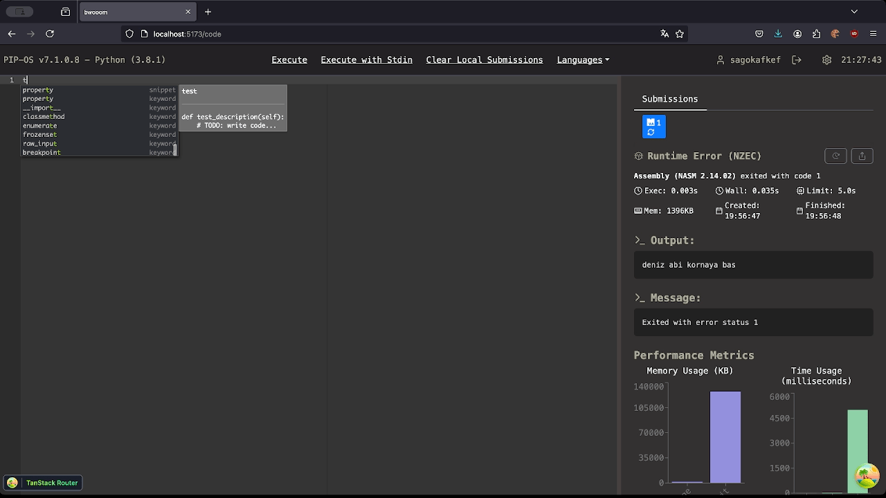
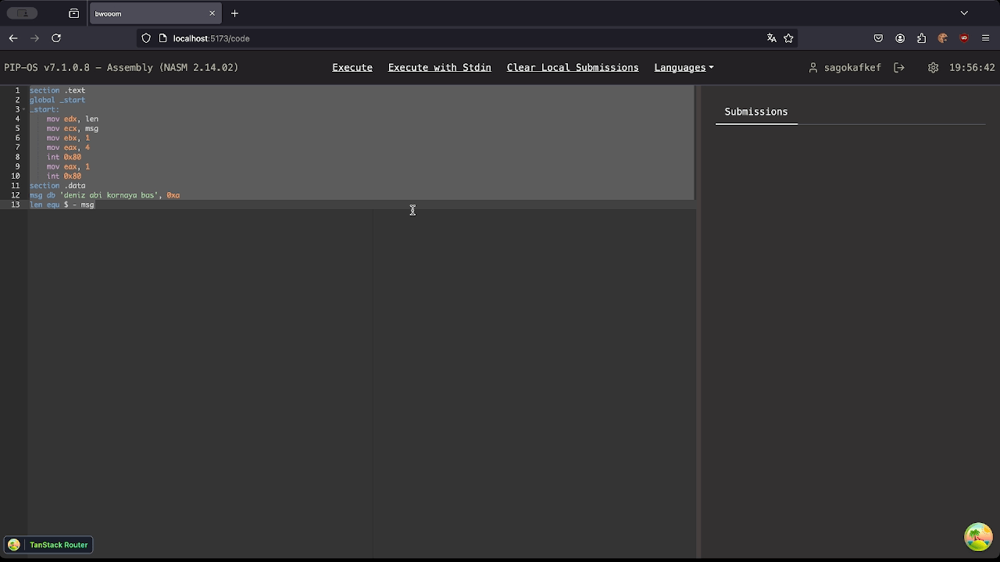
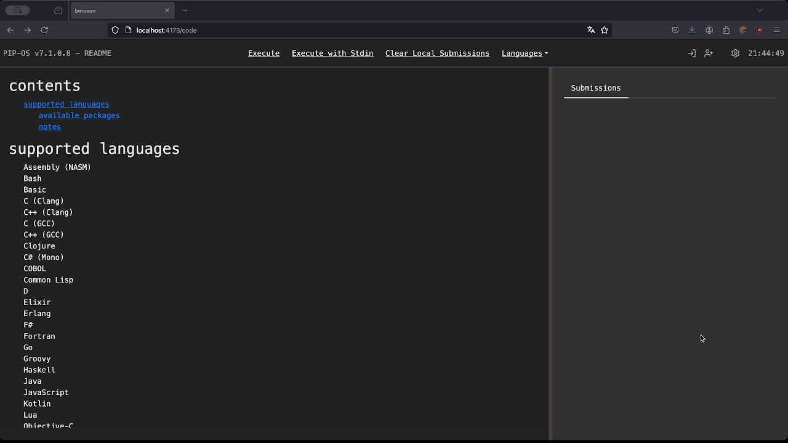
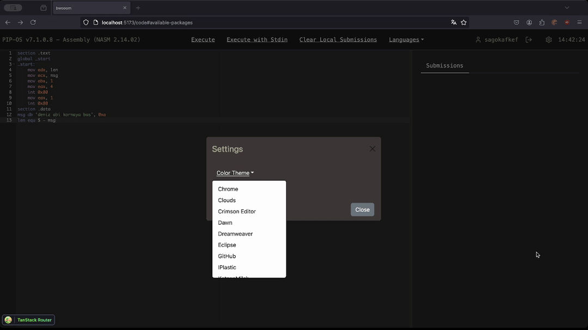

- [features](#features)
- [supported languages](#supported-languages)
  - [available packages](#available-packages)
  - [notes](#notes)
- [settings](#settings)

## features

Thanks to Ace Editor, we have the following features:

- Autocomplete and Snippets
  

- Network Friendly
  
This is what is most important to me in this project. You might say "dude we have unlimited gigabyte fiber internets who cares", but you can shove in all AI craps, popups, buzzwords,nothing will make me feel good as much as my sweet darling. From Haskell to NASM to Prolog to Lua, run everything with under 2 MB of network, all autocompletes and snippets included.

Here is a comparison with JDoodle. With no cache, from initial load to output, JDoodle consumes 3.05 megabytes. And this is only for COBOL. My precious darling loads needs only 900 KB of network initially, 
TO LOAD ALL LANGUAGES. Language switch only takes 200 kbs, where as JDoodle transfers 6 MB of network just to switch from COBOL to Fortran. And, JDoodle does not provide autocompletes and snippets.

here, check this video: https://youtu.be/St5z3afAguY (execution server is running on remote, somewhere in Poland, during all demos)

- Share Code Output

- Execution and Loading Speed

- Dynamic Color Theme

more to come, wip.

## supported languages

- Assembly (NASM)
- Bash
- Basic
- C (Clang)
- C++ (Clang)
- C (GCC)
- C++ (GCC)
- Clojure
- C# (Mono)
- COBOL
- Common Lisp
- D
- Elixir
- Erlang
- F#
- Fortran
- Go
- Groovy
- Haskell
- Java
- JavaScript
- Kotlin
- Lua
- Objective-C
- OCaml
- Octave
- Pascal
- Perl
- PHP
- Prolog
- Python
- R
- Ruby
- Rust
- Scala
- SQL
- Swift
- TypeScript
- Visual Basic.NET

### available packages

- python
  - mlxtend
  - numpy
  - pandas
  - scikit-learn
  - pytest
  - scipy

wip

### notes

- Basic and Octave has no modes, so they are rendered as plain text.
- readme.md in editor is the same as this file except there are no gifs.

## settings

- Color Theme
Set to Tomorrow Night Eighties by default. There are approximately 36 color themes, and you can change them in settings.
